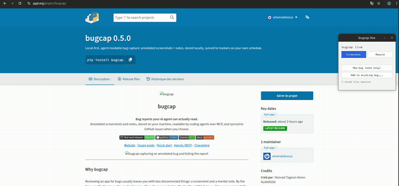

<p align="center">
  
</p>

<h1 align="center">bugcap</h1>

<p align="center">
  <b>Bug reports your AI agent can actually read.</b><br>
  Annotated screenshots and notes, stored on your machine, readable by coding agents over MCP, and synced to GitHub issues when you choose.
</p>

<p align="center">
  <a href="https://github.com/amenalahassa/bugcap/actions/workflows/release.yml"></a>
  
  <a href="LICENSE"></a>
  <a href="https://amenalahassa.github.io/bugcap/"></a>
</p>

<p align="center">
  <a href="https://amenalahassa.github.io/bugcap/">Website</a> ·
  <a href="https://amenalahassa.github.io/bugcap/usage.html">Usage guide</a> ·
  <a href="#quick-start">Quick start</a> ·
  <a href="#connect-your-agent-mcp">Agents (MCP)</a> ·
  <a href="CHANGELOG.md">Changelog</a>
</p>

<p align="center">
  
</p>

---

## Why bugcap

Reviewing an app for bugs usually leaves you with two disconnected things: a screenshot and a
mental note. By the time you file the issue, the context is gone. Once the screenshot is attached
to a GitHub issue, it becomes **unreadable to an API token**. The CDN only resolves in a browser
session, so an agent using `gh` can read the text but never the picture that explains the bug.

bugcap keeps the whole loop in one place:

| | |
|---|---|
| 📸 **Capture at the moment** | Annotated screenshots through `flameshot`, `satty` or `screencapture`. No new annotation UI. |
| 🗂️ **Local record** | A SQLite index and PNGs on disk. Nothing depends on GitHub being reachable. |
| 🤖 **Agent-readable** | A stdio MCP server hands reports, images included, to Claude Code and other agents. |
| 🔁 **Sync when ready** | Push to a GitHub issue with the usual inline image, plus a plain copy agents can read. |
| 🎞️ **Record what happens** | Short screen recordings as animated GIF, video or keyframes, with size caps. |
| 🖥️ **Triage in a browser** | A local dashboard on `127.0.0.1` to browse, filter and set statuses. |
| 🪟 **Live mode** | An always-on-top window (top-right) to capture or record, stage several items, then file a new bug, add to an existing one, or log a note-only bug. |

## Quick start

```bash
# install from PyPI
pipx install 'bugcap[mcp]'

bugcap setup --yes                      # detects or installs a capture tool
cd ~/code/myproject && bugcap init      # scope reports to this repo

bugcap capture --title "Login fails" --note "Error toast after submit" --tag auth
bugcap list
bugcap dashboard --open                 # browse and triage in the browser
```

The [usage guide](https://amenalahassa.github.io/bugcap/usage.html) covers every command: images
and labels, recording, live mode, `@` references, GitHub pull and sync, and the MCP tools.

## Connect your agent (MCP)

Requires the `mcp` extra. Then give your agent access to the reports:

```bash
claude mcp add bugcap -- bugcap mcp-serve
```

Or in a project's `.mcp.json`:

```json
{ "mcpServers": { "bugcap": { "command": "bugcap", "args": ["mcp-serve"] } } }
```

The server exposes six tools: `list_reports`, `get_report` (returns the screenshot), `request_screenshot`,
`pull_issues`, `attach_image` and `update_notes`. Logs go to `logs/mcp-server.log` in the data
directory, never to stdout.

Ask your agent something like *"list the open bugcap reports for this repo and fix the one with
the error toast"*. It can read the picture because it's a local file, not a CDN link.

## How it works

```
 capture ──► local store (SQLite + images/) ──► MCP / dashboard / CLI   (read by agents and you)
                       │
                       └──► sync ──► GitHub issue  +  committed image copy  (readable with gh api)
```

- **`capture` / `attach` / `record`** write to the store.
- **`mcp-serve`, `dashboard`, `list`, `show`** read from it.
- **`sync`** is the only thing that talks to a tracker, and only when you run it.

## Status

Working. Roadmap items 1–5, 7 and 8 are implemented and tested, along with spec 002 (images,
`@` references, recording, live mode and the dashboard). S3/R2 object storage (item 6) and other
trackers (item 9) are deferred. The `Destination` seam is in place, so they can be added without
changing the CLI. See [ROADMAP.md](ROADMAP.md).

## Installation

Requires Python 3.10 or newer. The core CLI uses only the standard library (plus `tomli` before
Python 3.11). The MCP server is an optional extra.

```bash
pipx install 'bugcap[mcp]'   # recommended
uv tool install 'bugcap[mcp]'
pip install -e '.[dev,mcp]'                                             # development
```

Supported capture backends: [`flameshot`](https://flameshot.org/) (cross-platform, recommended),
[`satty`](https://github.com/Satty-org/Satty) with `grim` (Linux/Wayland), and `screencapture`
(macOS). Run `bugcap setup` to see what's detected. You can always import an existing image with
`bugcap capture --image PATH`.

## Documentation

Full guide: **[amenalahassa.github.io/bugcap/usage.html](https://amenalahassa.github.io/bugcap/usage.html)**
covers capture, images, recording, live mode, triage, `@` references, the dashboard, GitHub
pull and sync, MCP, and where data lives per OS.

Notes on the more involved behaviour:

- **References.** In a note, `@i1` is image 1, `@v2` a video, `@g3` an animated GIF, `@f4` a frame set, and `@login-error` a labelled item. `#3` points at report 3 (a missing one is kept as text with a warning). Media references are validated on save, and relabelling or removing a referenced item needs `--force`.
- **Repo values** (`init`, `sync`, `config repo set`) are checked for format and, with `gh`, for existence. Changing the repo identity offers to move existing reports.
- **Media sync** over `[sync] max_upload_mb` (default 25) is skipped with a warning.

## Development

See [DEVELOPMENT.md](DEVELOPMENT.md). Run the tests with:

```bash
uv run --extra dev --extra mcp pytest -q
```

## Architecture

Module map (`src/bugcap/`):

| Module | Responsibility |
|---|---|
| `paths.py` | Per-OS data/config dirs; `BUGCAP_HOME` override. |
| `capture.py` | Import or capture images (`flameshot`/`satty`+`grim`/`screencapture`); `has_display()`. |
| `backends.py` | Capture-tool detection, per-OS install commands, manual guidance. |
| `store.py` | SQLite store (`reports`, `media`, `media_frames`; schema v2), `PRAGMA user_version` migrations, report API, `transaction()`. |
| `service.py` | **Shared rules** used by the CLI, MCP, dashboard and live mode: media add/relabel/remove, notes validation, reference rewrite, queries. Raises `ServiceError`. |
| `ingest.py` | Path/glob/URL inputs: magic-byte validation, size/timeout/redirect limits, atomic copy into `images/`. |
| `refs.py` | `@` reference parsing (code/email aware), validation, rewrite, display. |
| `recorder.py` | `ffmpeg`/`wf-recorder` argv per OS, stop/caps watchdogs, animated/frames post-processing. |
| `live.py` + `live_session.py` + `drafts.py` | Tk control window (thin) over a pure state machine; drafts on disk. |
| `dashboard/` | `http.server` UI + JSON API (loopback, Host/Origin checks, write token, Range media, static allowlist). |
| `repo.py` + `tomlio.py` | `.bugcap.toml` discovery/read/write (tag, github slug, `[sync]`). |
| `config.py` | Global `config.toml`: `[sync]` defaults, `[consent]` for image commits, `[log]`. |
| `validation.py` | Format checks for repo slugs, images path and branch names. |
| `logs.py` | `mcp-serve` logging (rotating file + stderr, never stdout). |
| `ghcli.py` | Thin `gh` wrapper (argv lists; large payloads via stdin). **Transport.** |
| `sync.py` | `Destination` protocol, `GitHubDestination`, `pull_issues`, `sync_report`. **Policy.** |
| `agent_api.py` | SDK-free tool logic for the six MCP tools. |
| `mcp_server.py` | Lazy-imports the `mcp` SDK; registers the `agent_api` tools over stdio. |
| `cli.py` | All subcommands. |

The **store is the one shared surface**. Capture writes to it; the CLI, the MCP server, and the
sync layer only read/update it — nothing talks to a tracker except `sync.py` (via `ghcli.py`), and
nothing requires a tracker to exist for capture to be useful.

**Extension seam (roadmap 6 & 9):** `sync.py` depends only on the small `Destination` protocol
(`ensure_ready`, `repo_visibility`, `get_file`, `put_file`, `create_issue`, `comment`,
`supports_attach`) and on the report's `synced_refs`. A future object store or tracker implements
that protocol — the CLI and store don't change. Refs are namespaced per destination:

- `github.issue` → `owner/repo#N`
- `github.comment_hash` → sha256 of the last synced content (so re-sync comments only on change)
- `github.image.<basename>` / `github.media.<basename>` → `owner/repo:path@commit` (so each file is committed at most once)
- `github.frame.<idx>.<n>` and `github.frames.<idx>` → keyframes of a recording (one commit per frame; GitHub's contents API commits one file at a time)

These refs also make pull and sync **idempotent and resumable**: each step is persisted as it
succeeds, so a re-run skips what is already recorded.

## Roadmap

See [ROADMAP.md](ROADMAP.md).

## Design notes / deliberate non-goals

- **No cloud storage by default, no vendor account.** The store is plain files on your disk. Sync
  (GitHub, and optionally an S3/R2 object store) is opt-in and explicit, per report.
- **Not a GitHub attachment replacement.** The CDN-attached image stays for humans browsing the
  issue normally; the repo-committed copy exists purely so agents can read it. Both are written
  on sync, deliberately redundant.
- **Not using Git LFS for synced copies.** GitHub's Contents API returns LFS pointer files, not
  the real bytes, for LFS-tracked paths — which would silently defeat the entire point of
  committing the copy. Plain commits are used instead; if screenshot volume ever outgrows that,
  the right next step is an external object store with its own token-authable download URLs, not
  LFS.
- **Annotation UI is not reinvented.** `bugcap` is glue around an existing capture/annotate tool,
  not a new one.

## License

MIT — see [LICENSE](LICENSE).
